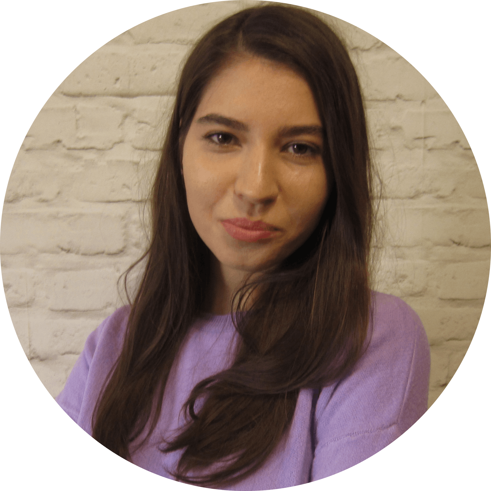

# Maria Zhirova
## Junior Frontend Developer


## **Contacts**
#### **Location:** Minsk, Belarus
#### **Phone:** +375 25 703 31 71
#### **Email:** masha.zhirova@yandex.ru

**[Linkedin](https://www.linkedin.com/in/maria-zhirova "Linkedin")** | 
**[GitHub](https://github.com/Mary-FE/ "GitHub")** |
**[Telegram](@Mary26_5 "Telegram")** |
**Discord:** Maria (@Mary-FE)

***
## **About me**
I am a novice front-end developer with high ambitions and a desire to develop. I am a non-confrontational person, I have a positive attitude to constructive criticism, I have a broad outlook, I am inquisitive, attentive to small things. I want to gain experience working in a team, gain new knowledge at RS School, find interesting projects where I could improve my skills, learn something new and put it into practice. And also to expand the circle of new acquaintances.
***
## **Skills:**
- HTML
- CSS/LESS
- JavaScript (Basic)
- Git
- Adobe Photoshop
- BEM
***
## **Code example**
```
function shortcut (string) {
  let symbols = ['a', 'e', 'i', 'o', 'u'],
      str_array = string.split(''),
      result = [];
  
  for (let i = 0; i < str_array.length; i++) {
      if (!symbols.includes(str_array[i])) {
        result.push(str_array[i]);
      }
  } 
  
  return result.join('');
}
```
***
## **Experience**
I am self-taught, for a year I studied and practiced frontend under the guidance of a signor front end developer (my husband). During this time, I studied HTML, CSS, and JS at the level necessary for initial work.
***
## **Education**
* Irkutsk State Medical University
    + Doctor of General Hygiene, Epidemiology
***
## **English**
A2
